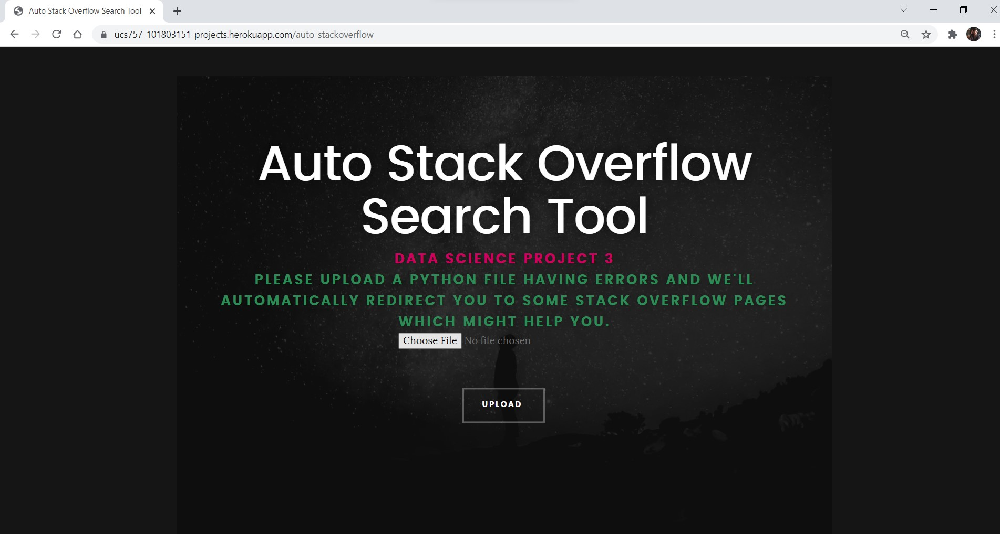

# UCS757:Building Innovative Systems
## Submitted by:-
### Rohan Dutt
### 101803151
### COE 8

# Projects
## Live Link
https://ucs757-101803151-projects.herokuapp.com

## Home

# Project 3: Auto Stack Overflow Search Tool
## Introduction
We all have faced issues while learning a new language or coding in the same. Well, this tool takes your python file and automatically figures out the errors and open up all the stack overflow pages which might help you.

## Requirements
1. Python
2. Requests
3. NodeJS
4. EJS

## Browser Requirements
Kindly allow popups to allow the app to function properly.

## Live Link
https://ucs757-101803151-projects.herokuapp.com/auto-stackoverflow

## Input Interface

## Input

## Output

## Flowchart

## Novelty
1. This is a new concept, of actually opening the webpages which might give the user the required solutions to the problems in their code
2. Piping the data from python, then receiving it in Nodejs and redirecting the user to stack overflow pages
3. The use case is quite common and will solve a lot of problems as we all face issues while learning a new language or working on a project.

## Limitation
This tool is limited to python only for the time being and is dependent on the errors solutions to be present on Stack Overflow. Also, if the popups are not enabled, new webpages won't open.
